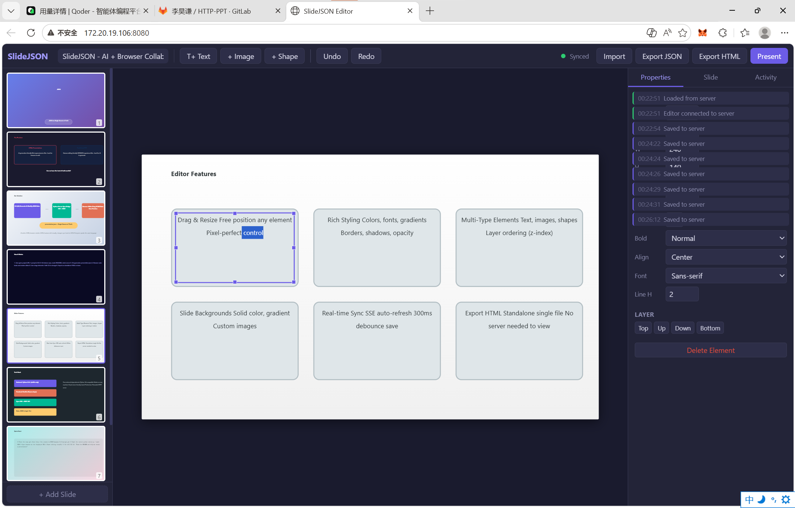

# SlideJSON - AI驱动的HTML演示文稿编辑器



一个通过CLI AI工具（如Qoder）和浏览器协同编辑HTML演示文稿的工具。CLI负责内容生成和智能修改，浏览器提供PPT式的可视化编辑，双方通过本地Server实时同步。

## 仓库地址

```
http://dev.zstack.io:9080/haoqian.li/http-ppt.git
```

## 快速开始

### 1. 克隆项目

```bash
git clone http://dev.zstack.io:9080/haoqian.li/http-ppt.git
cd http-ppt
```

### 2. 启动Server

```bash
# 本地使用
python3 server.py --port 8080

# 云服务器/远程访问（指定IP或绑定所有接口）
python3 server.py --host 0.0.0.0 --port 8080
```

启动后Server会自动检测IP并显示访问地址。`--host 0.0.0.0` 表示监听所有网络接口（默认值），适用于云服务器场景，用户通过服务器公网IP访问。

### 3. 打开浏览器

访问Server启动时输出的地址（如 `http://<你的服务器IP>:8080`）即可看到PPT编辑器。

### 4. CLI与浏览器协作

- **在CLI中**告诉AI"修改presentation.json"，浏览器会实时刷新
- **在浏览器中**拖拽/编辑元素，改动会自动保存到presentation.json
- 两种方式可以交替使用，数据始终保持同步

## 文件结构

```
http-ppt/
├── index.html            # 编辑器前端（浏览器打开）
├── server.py             # 本地Server（Python3，零依赖）
├── presentation.json     # 演示文稿数据（自动生成，CLI和浏览器共同读写）
├── example.json          # 示例数据（可导入参考）
└── README.md             # 本文件
```

## 数据格式 (presentation.json)

```json
{
  "meta": { "title": "演示标题", "author": "作者" },
  "slides": [
    {
      "id": "s-1",
      "background": { "color": "#ffffff", "image": "", "gradient": "" },
      "elements": [
        {
          "id": "el-1",
          "type": "text",
          "x": 80, "y": 160,
          "width": 800, "height": 80,
          "content": "标题文字",
          "style": {
            "fontSize": "48px",
            "fontWeight": "bold",
            "color": "#1a1a2e",
            "textAlign": "center",
            "fontFamily": "sans-serif",
            "lineHeight": "1.2"
          },
          "zIndex": 1
        }
      ],
      "notes": "演讲者备注"
    }
  ]
}
```

### 元素类型

| type | 说明 | 关键style属性 |
|------|------|---------------|
| `text` | 文本框 | fontSize, fontWeight, color, textAlign, fontFamily, lineHeight |
| `image` | 图片 | objectFit, backgroundColor, borderRadius |
| `shape` | 形状 | backgroundColor, borderRadius, borderColor, borderWidth |

### 画布尺寸

固定 **960 x 540** 像素（16:9），元素的x/y/width/height都基于此坐标系。

## Server API

| 端点 | 方法 | 说明 |
|------|------|------|
| `GET /api/presentation` | GET | 读取当前presentation.json |
| `POST /api/presentation` | POST | 保存presentation.json（body为JSON） |
| `GET /api/events` | GET | SSE事件流，文件变化时推送通知 |
| `GET /api/status` | GET | 服务状态 |

## 浏览器编辑器功能

- **拖拽移动/缩放**元素（8个控制手柄）
- **双击**编辑文本 / 设置图片URL
- **右键菜单**：删除、复制、图层调整、添加元素
- **属性面板**：位置/大小、文字样式、图片设置、形状属性、图层控制
- **快捷模板**：Title / Content / Two Column / Image+Text / Quote / Blank
- **键盘快捷键**：
  - `Ctrl+Z` / `Ctrl+Y` — 撤销/重做
  - `Delete` — 删除选中元素
  - `Ctrl+D` — 复制元素
  - 方向键 — 微调位置（+Shift步进10px）
- **导出**：Export JSON / Export HTML（独立可演示的HTML文件）
- **演示模式**：全屏播放，方向键翻页

---

## CLI AI提示词

以下提示词用于指导CLI AI工具（如Qoder）如何操作本项目。用户只需将仓库链接和下方提示词提供给AI，即可开始协作。

### 提示词

```
你现在是一个HTML演示文稿的协作编辑助手。你将通过直接修改 presentation.json 文件来创建和编辑演示文稿，浏览器端的编辑器会实时同步你的修改。

## 项目结构
- presentation.json 是唯一的数据源，你读写这个文件来控制演示文稿
- server.py 提供本地HTTP服务，你需要先启动它
- 启动后Server会自动输出访问地址（包含IP和端口）

## 你的工作流程

### 首次启动
1. 进入项目目录
2. 运行 `python3 server.py --port 8080 &` 在后台启动服务（云服务器默认绑定 0.0.0.0，所有接口可访问）
3. 观察启动输出中的地址（如 http://10.x.x.x:8080），告诉用户在浏览器打开该地址
4. 注意：如果是云服务器，确保安全组/防火墙放通了对应端口

### 生成演示文稿
当用户要求创建演示文稿时，直接生成完整的 presentation.json 写入文件。

### 修改演示文稿
当用户要求修改时：
1. 先读取当前 presentation.json 了解现状
2. 修改对应的内容（修改元素属性、增删元素、增删幻灯片等）
3. 写入 presentation.json，浏览器会自动刷新

### 数据格式要点
- 画布大小: 960x540 像素
- 每个slide包含 id, background, elements, notes
- 每个element包含 id, type(text/image/shape), x, y, width, height, content, style, zIndex
- text元素的style: fontSize, fontWeight, color, textAlign, fontFamily, lineHeight
- image元素的content是图片URL，style: objectFit, backgroundColor, borderRadius
- shape元素的style: backgroundColor, borderRadius, borderColor, borderWidth, borderStyle
- zIndex控制图层顺序，数字越大越靠前

### 用户浏览器编辑
用户可能在浏览器中拖拽/编辑了元素，所以修改前务必先读取最新的 presentation.json。

### 注意事项
- 元素id格式: "el-数字"，slide id格式: "s-数字"，确保id不重复
- content字段支持HTML（如 <ul><li>...</li></ul>、<b>加粗</b> 等）
- 颜色支持任何CSS颜色值（hex、rgb、rgba等）
- background.gradient 支持CSS渐变（如 "linear-gradient(135deg, #667eea 0%, #764ba2 100%)"）
```

### 使用方式

将以下内容发给CLI AI工具即可开始：

> 请克隆 https://github.com/hock1024always/html-ppt ，读一下README，然后帮我做一个关于[你的主题]的演示文稿。

AI会自动理解项目结构、启动Server、生成内容，你在浏览器中实时预览和微调。
